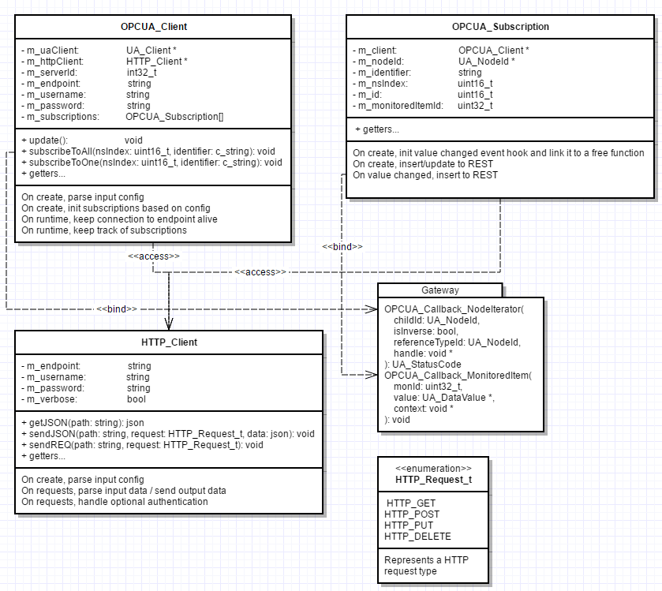

OPC UA Data Gateway
===================

This is an OPC UA client service that connects to target endpoints, subscribes to manually configured namespaces and nodes and starts pushing the subscribed object values to a REST service.

Related projects
----------------
1. Gateway project: [OPC UA Data Gateway](https://github.com/Harha/OPC-UA-Data-Gateway)
2. REST project: [OPC UA Data REST](https://github.com/Harha/OPC-UA-Data-REST)
3. Socket.io project: [OPC UA Data Server](https://github.com/Harha/OPC-UA-Data-Server)
4. Client project: [OPC UA Data Visualizer](https://github.com/Harha/OPC-UA-Data-Visualizer)

Dependencies
------------
1. open62541
2. libcurl
3. curlcpp
4. JSON for Modern C++
	* Included in ./src as single-header lib

This repository includes dynamically linked Win32 versions of the libraries listed above.

1. ./inc
2. ./lib
3. ./bin

Building
--------
TODO: CMakeLists.txt

Currently the repository includes a visual studio 2015 project. In the future that will be replaced with a CMakeLists.txt file.

Configuration
-------------
1. ./res/settings.json
	* ua_service_config
	* ua_rest_config
	* ua_client_config

Structure
---------

_a Simplified UML-diagram demonstrating the communication between objects in the service._

Licenses
--------
1. This software: LICENSE
2. open62541: LICENSE_open62541
3. libcurl: LICENSE_libcurl
4. curlcpp: LICENSE_curlcpp